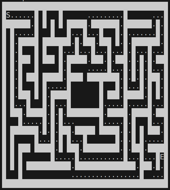

[](https://pkg.go.dev/github.com/vinser/maze)

[](https://goreportcard.com/report/github.com/vinser/maze)
[](https://codecov.io/github/vinser/maze)


# Go Maze Generator

A highly configurable maze generator written in Go.  
It can be used as a command-line tool or as a library in your own Go projects.  
Create complex mazes, add a central room ("den"), and visualize the solution path.
Gemini Code Assisted



## Features

-   Customizable maze dimensions (`--width`, `--height`).
-   Configurable central room/den (`--denWidth`, `--denHeight`).
-   Guaranteed door placement on the den (`--doorSide`, `--doorX`, `--doorY`).
-   Adjustable corridor "straightness" with a bias parameter (`--bias`).
-   Built-in solver that can display a partial or full solution path (`--solveRatio`).
-   Reproducible maze generation using seeds (`--seed`).

## Installation

### As a command-line tool

To install the `mazegen` command-line tool, use `go install`:

```bash
go install github.com/vinser/maze/cmd/mazegen@latest
```

Make sure your Go environment is set up correctly and that `$GOPATH/bin` is in your system's `PATH`.

### As a library 

To use this package in your own Go code, use go get: 

```bash
go get github.com/vinser/maze
```
## Usage

### Command-Line Interface (mazegen)
Run the generator from your command line. 

#### Basic Maze

```bash
mazegen --width=51 --height=25
```

#### Maze with a Den and a Top Door

```bash
mazegen --width=41 --height=21 --denWidth=11 --denHeight=7 --doorSide=top
```

#### Generate and Show 50% of the Solution

```bash
mazegen --width=41 --height=21 --solveRatio=0.5
```

#### Reproducible Maze with High Bias 
This example demonstrates using a seed for reproducible results and a high bias for longer, straighter corridors. 

```bash 
mazegen --width=51 --height=25 --seed=1337 --bias=0.95
```

#### All Flags

```
  -bias float
    	Bias for straight corridors (0.0 to 1.0). 0 is random, 1 always goes straight if possible. (default 0.5)
  -denHeight int
    	The height of the central den. Set to 0 for no den.
  -denWidth int
    	The width of the central den. Set to 0 for no den.
  -doorSide string
    	Side for the den door (top, bottom, left, right). Overrides --doorX/Y.
  -doorX int
    	The X coordinate for the den door. If 0, a random door is chosen.
  -doorY int
    	The Y coordinate for the den door. If 0, a random door is chosen.
  -height int
    	The height of the maze (default 21)
  -seed int64
    	Seed for the random number generator. If 0, uses current time.
  -solveRatio float
    	The fraction of the solution path to display (0.0 to 1.0). If not set, maze is not solved. (default -1)
  -startX int
    	The X coordinate for the generation start point. If 0, a random point is chosen.
  -startY int
    	The Y coordinate for the generation start point. If 0, a random point is chosen.
  -width int
    	The width of the maze (default 41)
```

### As a Go Library 
You can easily integrate the maze generation logic into your own applications. 

Here's a basic example of how to create, generate, and print a maze:

```go 
package main

import (
	"fmt"
	"log"

	"github.com/vinser/maze"
)

func main() {

	// Create a new 21x11 maze.
	m, err := maze.New(21, 11, 0, 0)
	if err != nil {
		log.Fatalf("failed to create maze: %v", err)
	}
	// Generate the maze paths with a fixed seed for reproducibility
	// and a bias for straighter corridors.
	err = m.Generate(1337, nil, nil, "", 0.95)
	if err != nil {
		log.Fatalf("failed to generate maze: %v", err)
	}
	// The maze can be solved using m.Solve()
	// solution, found := m.Solve()
	// Print the maze structure by iterating through its cells.
	for y := 0; y < m.Height(); y++ {
		for x := 0; x < m.Width(); x++ {
			cell, _ := m.Cell(x, y)
			fmt.Printf("%c", cell)
		}
		fmt.Println()
	}
}
```
For more details on the available functions, see the [Go Reference](https://pkg.go.dev/github.com/vinser/maze).

## License

This project is licensed under the MIT License - see the LICENSE file for details.